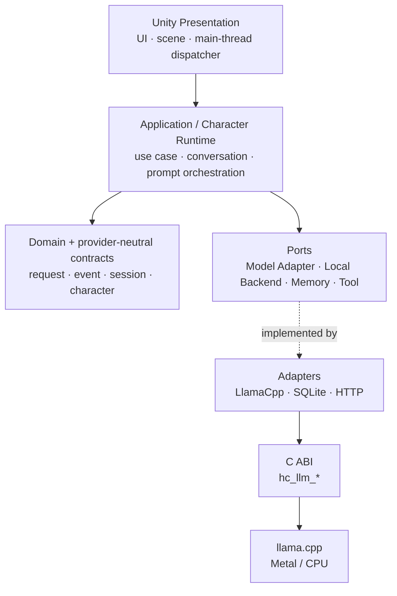
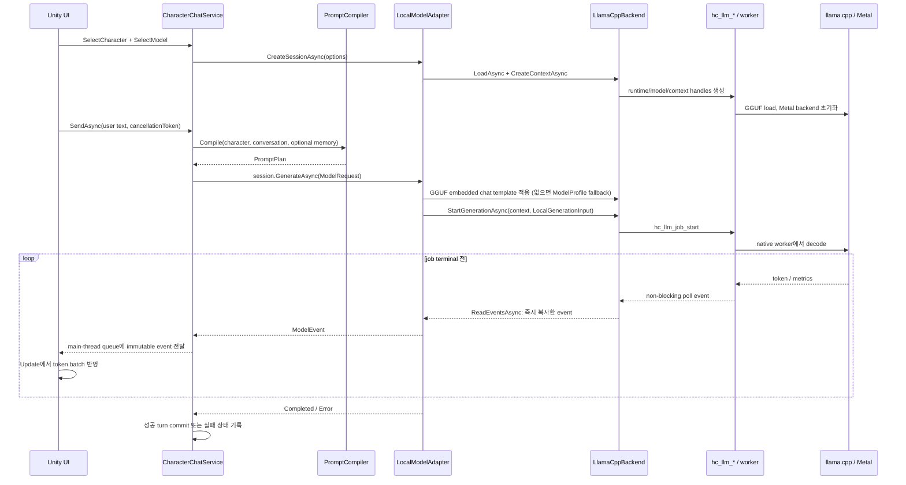
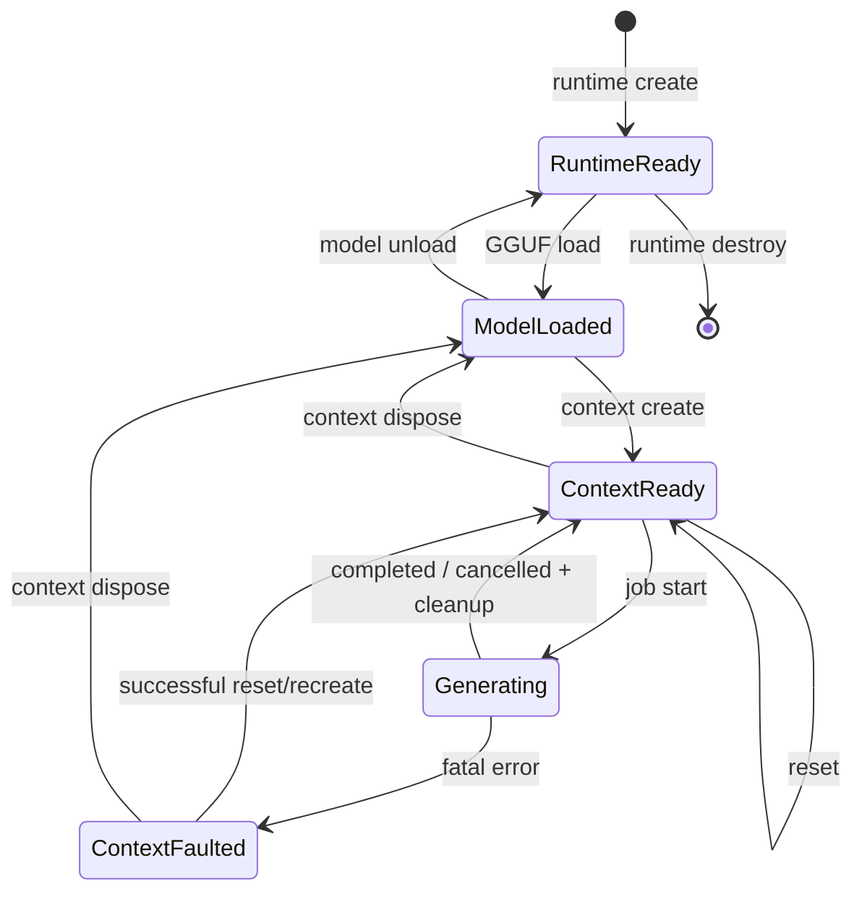

# HaruChat2 아키텍처

상태: **Accepted — 구현 전 기준선**

대상: MVP 및 이후 확장을 위한 논리·물리 경계

관련 문서: [요구사항](REQUIREMENTS.md) · [개발 가이드](DEVELOPMENT.md) · [Roadmap](ROADMAP.md) · [ADR 인덱스](adr/README.md)

## 1. 목적과 범위

HaruChat2는 iPad에서 로컬 GGUF 모델을 실행하고, 데이터로 정의한 캐릭터와 대화하는 Unity 애플리케이션이다. MVP의 종단 경로는 다음과 같다.

> 캐릭터 선택 → 로컬 모델 선택·load → 캐릭터 prompt compile → Metal 기반 generation → token streaming → Unity UI 표시

이 문서는 위 경로를 구현할 때 지켜야 할 의존성, 계약, 리소스 수명, 스레딩 및 확장 경계를 고정한다. 구현 세부 값과 진행 순서는 각각 [요구사항](REQUIREMENTS.md)과 [Roadmap](ROADMAP.md)이 canonical source다. 이 문서는 기능 목록이 아니라 **기능이 어디에 속하고 계층 사이에서 어떤 계약으로 이동하는지**의 canonical source다.

MVP에서는 다음 제약을 의도적으로 받아들인다.

- 프로세스에 resident model은 최대 1개다.
- 활성 `IModelSession`과 native context도 최대 1개다.
- context 하나에서 동시에 실행하는 generation은 최대 1개다.
- 모델과 캐릭터 선택은 수동이며, model routing과 background preloading은 하지 않는다.
- generation은 text-only이며 image input과 vision projector를 포함하지 않는다.
- Memory, Agent/Tool 실행과 OpenAI-compatible 원격 provider는 post-MVP 확장으로 구현하며, Live2D는 여전히 Presentation 확장 지점으로만 유지한다.

## 2. 핵심 원칙

1. **Core는 Unity-free다.** Domain, application, Character Runtime과 provider-neutral 계약은 `.NET Standard 2.1` 소스로 작성하며 `UnityEngine`, MonoBehaviour, GameObject, ScriptableObject를 참조하지 않는다.
2. **의존성은 안쪽을 향한다.** 정책을 담은 계층은 native, SQLite, HTTP, Unity 같은 구체 기술을 모른다. 바깥 adapter가 안쪽 port를 구현한다.
3. **Model Adapter와 local backend를 분리한다.** chat template, persona, tool/reasoning convention은 `LocalModelAdapter + ModelProfile`의 책임이고, `ILocalModelBackend`는 load/context/generation/cancel/metrics만 담당한다.
4. **C ABI는 작고 명시적이다.** C++ 타입과 예외를 경계 밖으로 노출하지 않으며 opaque handle, versioned struct, UTF-8, caller-visible ownership 규칙을 사용한다.
5. **stream은 callback이 아닌 polling queue로 건넨다.** native worker가 이벤트를 만들고 managed poll pump가 가져온다. Unity main thread는 inference나 blocking poll을 수행하지 않는다.
6. **데이터는 코드보다 바깥에 둔다.** 캐릭터와 모델별 차이는 `CharacterBundle`과 `ModelProfile`로 표현한다. 모델 변경을 위해 Domain 또는 native 코드를 수정하지 않는다.
7. **offline과 최소 보존이 기본값이다.** MVP 경로는 네트워크를 요구하지 않는다. 이후 원격 provider와 telemetry는 명시적 opt-in 경계 안에서만 동작한다.
8. **native ABI는 platform-neutral이다.** `hc_llm_*`는 Linux, Apple, 장래 Android의 artifact 형식과 무관한 C11 계약이다. 플랫폼별 load path와 packaging은 infrastructure/composition 책임이며 ABI에 들어가지 않는다.

## 3. 계층과 의존성



화살표는 compile-time dependency의 허용 방향이다. 구체적인 규칙은 다음과 같다.

| 계층 | 주요 책임 | 참조할 수 있음 | 참조하면 안 됨 |
|---|---|---|---|
| Unity Presentation | 화면, 입력, scene, frame 단위 token 반영, device lifecycle 전달 | Application, Domain DTO | llama.cpp, P/Invoke, SQLite, HTTP 구현 |
| Application / Character Runtime | use case 조정, 캐릭터 load, prompt 구성, conversation 상태, session 전환 | Domain, ports | Unity 타입, llama.cpp 타입, SQL |
| Domain + contracts | immutable value, 오류 분류, provider-neutral model stream 계약 | BCL | Unity, native, DB, 특정 모델 template |
| Adapter ports | 외부 기능의 최소 interface | Domain | 구체 adapter |
| Infrastructure adapters | port 구현, 변환, 리소스 ownership | port, 외부 기술 | Unity Presentation |
| Native ABI / llama.cpp | GGUF load, context, decode worker, Metal/CPU | C/C++, llama.cpp | Character, Conversation, provider-neutral tool 정책 |

역방향 호출이 필요하면 직접 참조 대신 event 또는 port를 쓴다. 예를 들어 Application은 Unity UI를 호출하지 않고 `ModelEvent`를 내보내며, Unity가 이를 구독한다.

## 4. 향후 저장소 구조

아래 구조는 구현이 생길 때 생성한다. 설계 단계에서 빈 디렉터리는 만들지 않는다.

```text
/
├── packages/
│   ├── com.haruchat.runtime/          # Domain, Application, Character Runtime
│   ├── com.haruchat.llamacpp/         # ILocalModelBackend managed adapter/P/Invoke
│   ├── com.haruchat.memory.sqlite/    # post-MVP SQLite+FTS5 adapter
│   ├── com.haruchat.openai/           # opt-in OpenAI-compatible HTTP/SSE adapter
│   └── com.haruchat.unity/            # Unity Presentation integration
├── native/
│   ├── llmcore/                       # hc_llm_* C ABI와 테스트
│   └── third_party/llama.cpp/         # pinned upstream submodule
├── unity/HaruChat/                    # Unity 6.3 LTS project
├── characters/                        # 개발용 character bundle; 라이선스 확인된 데이터만
├── tests/                             # managed/native/integration fixtures
├── scripts/                           # 재현 가능한 build·verification entry point
├── ci/                                # Codemagic 및 fallback CI 구성
└── docs/                              # 요구사항, 아키텍처, ADR, Roadmap
```

`com.haruchat.runtime`의 runtime source는 `.NET Standard 2.1` API만 사용한다. Linux의 .NET 10 LTS test host와 Unity가 같은 source를 compile한다. test host용 project 파일이 runtime source에 플랫폼 조건부 동작을 끌어들이지 않도록 한다.

### 4.1 Native artifact portability

M1의 생산 artifact는 Linux `libllmcore.so`다. Phase 2는 동일 header와 symbol set을 iOS `LlmCore.xcframework`로 package한다. 장래 Android는 같은 ABI를 Android arm64-v8a `libllmcore.so`로 cross-compile할 수 있게 CMake target과 artifact layout만 보존한다. Android Java/Kotlin binding, Unity Android plugin import, SDK/NDK 설치, Android device/CI 검증은 MVP와 M1 범위 밖이다.

ABI header에는 platform-specific path, Objective-C/Swift, JNI, Java/Kotlin 또는 Unity type을 추가하지 않는다. 각 platform binding은 `ILocalModelBackend`의 concrete infrastructure implementation으로만 추가하며 Character Runtime과 `LocalModelAdapter`를 변경하지 않는다.

## 5. 핵심 계약과 타입

아래 선언은 책임과 형태를 고정하기 위한 C# 유사 코드다. namespace와 세부 member명은 구현 중 조정할 수 있지만 계층 분리와 의미는 바꾸지 않는다.

### 5.1 Provider-neutral model 계약

```csharp
public interface IModelAdapter
{
    ModelCapabilities Capabilities { get; }

    ValueTask<IModelSession> CreateSessionAsync(
        ModelSessionOptions options,
        CancellationToken cancellationToken);
}

public interface IModelSession : IAsyncDisposable
{
    SessionId Id { get; }

    IAsyncEnumerable<ModelEvent> GenerateAsync(
        ModelRequest request,
        CancellationToken cancellationToken);

    ValueTask ResetAsync(CancellationToken cancellationToken);
    ValueTask<ModelMetricsSnapshot> GetMetricsAsync(CancellationToken cancellationToken);
}
```

provider-neutral generation 계약은 상태가 있는 `IModelSession`에서 `ModelRequest → IAsyncEnumerable<ModelEvent>`로 표현한다. `IModelAdapter`는 provider capability와 session 생성을 담당한다. 이 구분으로 context 수명을 conversation/session 수명과 일치시키면서도 local 및 원격 provider가 같은 Application use case를 공유한다.

핵심 데이터 타입은 다음과 같다.

| 타입 | 의미와 불변 조건 |
|---|---|
| `ModelRequest` | message 목록, generation option, optional tool schema, correlation ID를 담는 immutable value. 특정 provider의 token ID나 raw template 문자열을 포함하지 않는다. |
| `ModelMessage` | `System`, `User`, `Assistant`, `Tool` role과 UTF-8 text/structured part. Unity rich text를 포함하지 않는다. |
| `ModelSessionOptions` | model selector와 context budget 같은 provider-neutral 의도. local 경로에서는 별도 runtime 설정의 model path/checksum과 결합된다. |
| `ModelEvent.Token` | 사용자에게 표시 가능한 streaming text fragment. fragment 하나가 token 하나라는 보장은 없다. |
| `ModelEvent.Reasoning` | provider가 구분해 제공할 때만 나오는 reasoning fragment. UI 노출 정책은 Presentation 책임이다. |
| `ModelEvent.ToolCall` | 이름, call ID, 누적 완료된 argument payload. 실행 권한을 뜻하지 않는다. |
| `ModelEvent.Usage` | prompt/generated token 수, TTFT, prompt/generation TPS, context 사용량 등 현재까지의 snapshot. 미지원 값은 명시적으로 absent다. |
| `ModelEvent.Completed` | 정상 terminal event. stop reason은 `Stop`, `Length`, `ToolCall` 등을 구분한다. stream마다 최대 1개다. |
| `ModelEvent.Error` | generation 시작 뒤 발생한 terminal operational error. 안정된 `ErrorCode`, 안전한 사용자 message, 선택적 진단 ID를 포함한다. |

`ModelEvent`는 순서가 보존되며 `Completed` 또는 `Error` 뒤에는 어떤 event도 나오지 않는다. 구성·입력 검증 실패는 generation을 시작하지 않고 예외로 보고할 수 있다. generation 도중 오류는 `Error`로 끝낸다. 소비자가 전달한 `CancellationToken`이 취소되면 adapter는 native cancel과 cleanup을 끝낸 뒤 enumeration을 `OperationCanceledException`으로 종료한다. 이 경우 `Completed`나 `Error`를 합성하지 않는다.

### 5.2 Local model adapter와 profile

```text
ModelRequest
    ↓
LocalModelAdapter
    ├── Character PromptPlan 결합
    ├── ModelProfile chat template 적용
    ├── tool/reasoning convention encode/decode
    └── backend event → ModelEvent 변환
    ↓
ILocalModelBackend
    ↓
LlamaCppBackend → hc_llm_* → llama.cpp
```

`LocalModelAdapter`는 `IModelAdapter`를 구현한다. `ModelProfile`은 데이터 기반이며 최소한 다음을 설명한다.

- profile ID와 schema version
- 호환 model 식별 조건 또는 사용자가 선택한 binding
- chat template 및 BOS/EOS/stop sequence 정책
- context window와 generation default/limit
- tool call 및 필요한 경우에만 사용하는 non-standard reasoning output marker/parser override. 기본 adapter는 `<think>…</think>`와 `<|im_end|>`를 profile 없이 정규화하고, `reasoningOutput`은 다른 delimiter 또는 `show`/`separate` 정책이 검증될 때만 선언한다.
- tokenizer/template capability 요구사항

`ModelProfile`은 GGUF path 자체나 비밀정보를 저장하지 않는다. 실제 모델 설치 정보는 runtime configuration의 path와 checksum으로 관리한다. profile ID를 지정하지 않으면 `LocalModelAdapter`는 먼저 로드된 GGUF의 `tokenizer.chat_template`을 native C ABI로 적용한다. 따라서 정상적인 template을 포함한 새 GGUF는 파일 선택만으로 도입되며, quantization별 manifest·profile JSON·adapter class가 필요하지 않다. template을 지원하지 않는 legacy GGUF만 metadata가 정확히 하나와 일치하는 catalog profile을 fallback으로 사용한다. 명시 profile ID는 embedded template보다 우선한다. 기본 adapter는 `<think>…</think>`와 `<|im_end|>`를 profile 없이 정규화한다. profile은 tool, 비표준 reasoning delimiter, stop sequence, context/generation policy처럼 GGUF template만으로 표현되지 않는 예외적 정책만 제공한다. `reasoningOutput` override는 reasoning을 제거·표시·별도 `ModelEvent.Reasoning` channel로 전달할 때 사용하며 raw marker 자체는 노출하지 않는다. profile을 바꾸는 동작은 기존 session/context를 폐기한 뒤 새 session을 만든다. `CharacterChatService.ReplaceSessionAsync`는 composition root가 만든 새 session을 직렬화하여 교체하고, active generation을 cancel한 뒤 기존 conversation을 reset한다. 따라서 model/profile/character state를 한 context에 섞지 않는다.

`ILocalModelBackend`는 다음 기능에만 한정한다. M1은 runtime package에 이 port와 handle/options/event/metrics DTO 및 mock contract test를 선언할 수 있지만 native P/Invoke와 `LlamaCppBackend` concrete implementation은 Phase 4의 책임이다.

M1 contract는 native runtime lifetime을 명시하기 위해 `CreateRuntimeAsync`/`DestroyRuntimeAsync`와 generation handle의 `DestroyGenerationAsync`를 포함하며, raw native polling을 `PollEventsAsync` batch로 노출한다. Phase 4의 `LlamaCppBackend`가 이를 C ABI에 매핑하고 `LocalModelAdapter`가 polling 결과를 `IAsyncEnumerable<ModelEvent>`로 변환한다. 이 local polling port는 provider-neutral `IModelSession`의 public streaming interface가 아니다.

```csharp
public interface ILocalModelBackend : IAsyncDisposable
{
    ValueTask<LocalModelHandle> LoadAsync(LocalModelLoadOptions options, CancellationToken ct);
    ValueTask<LocalContextHandle> CreateContextAsync(LocalModelHandle model, LocalContextOptions options, CancellationToken ct);
    ValueTask<LocalGenerationHandle> StartGenerationAsync(LocalContextHandle context, LocalGenerationInput input, CancellationToken ct);
    IAsyncEnumerable<LocalGenerationEvent> ReadEventsAsync(LocalGenerationHandle generation, CancellationToken ct);
    ValueTask CancelAsync(LocalGenerationHandle generation);
    ValueTask ResetContextAsync(LocalContextHandle context, CancellationToken ct);
    ValueTask<LocalBackendMetrics> GetMetricsAsync(LocalContextHandle context, CancellationToken ct);
}
```

handle은 managed 안전 wrapper이며 반드시 `IAsyncDisposable`/`SafeHandle` 계열 ownership을 갖는다. unload는 model handle dispose, context destroy는 context handle dispose로 표현한다. `LocalModelAdapter`는 `StartGenerationAsync → ReadEventsAsync → generation dispose`를 자신의 public `GenerateAsync` enumeration 수명 안에서 조정하고 cancellation token을 명시적 `CancelAsync` 호출로 연결한다. 현재 local adapter는 `ModelRequest`의 완전한 conversation snapshot을 매 generation 직전에 native context reset 후 재평가한다. 따라서 conversation 기억의 source of truth는 native KV cache가 아니라 `Conversation`이며, history가 native context에 중복 누적되지 않는다. `LocalGenerationInput`은 이미 template이 적용된 text/tokenization 의도와 sampling option만 담는다. backend는 Qwen, 캐릭터, conversation, tool 이름을 알지 못한다.

### 5.3 Character Runtime

| 타입/서비스 | 책임 |
|---|---|
| `CharacterCatalog` | 유효한 bundle을 발견하고 case-insensitive한 전역 character ID 중복을 거부한다. |
| `CharacterBundleLoader` | 파일 경계와 schema를 검증하고 immutable `CharacterDefinition`을 만든다. |
| `PromptCompiler` | Character section, runtime input, conversation, 추후 memory를 provider-neutral `PromptPlan`/`ModelMessage`로 구성한다. |
| `Conversation` | turn 순서와 상태, process-local 원문 archive 및 압축 summary를 보존하는 Domain aggregate. native context나 Unity object를 소유하지 않는다. |
| `CharacterChatService` | character, conversation, model session의 수명을 조정하고 generation stream을 Application 바깥에 전달한다. |

`PromptCompiler`는 Qwen chat template을 출력하지 않는다. 의미 있는 role/section을 가진 provider-neutral `PromptPlan`을 만들고, `LocalModelAdapter`가 선택된 `ModelProfile`에 맞춰 serialize한다. 따라서 같은 캐릭터가 추후 OpenAI-compatible adapter에서도 그대로 동작한다.

8 Ki 기본 context에서는 2,048-token 출력 reserve를 먼저 차감한다. 다음 요청의 실제 local tokenizer count가 prompt budget의 70%에 도달하면 `CharacterChatService`가 최근 8개 완료 turn과 새 입력을 남기고 오래된 원문 archive를 local-only structured summary로 재생성해 55% 이하를 목표로 줄인다. summary는 memory 뒤·최근 원문 앞의 system section이며 memory와 별도 budget을 갖는다. `PromptCompiler`는 history를 추정치로 조용히 제외하지 않으며, compression 실패 뒤에도 최근 8개 완료 turn을 보호한 상태에서만 exact-count overflow 처리를 한다. 필수 section과 최신 입력만으로도 맞지 않으면 생성 전에 `ContextBudgetExceeded`를 반환한다. native decode의 context exhaustion도 같은 구조화 오류로 map한다. KV cache shift는 사용하지 않고 full reset/replay를 유지한다. 96/128 Ki는 memory-pressure device gate를 통과한 explicit override일 때만 사용한다.

### Long-context native allocation policy

`n_ctx`는 KV cache를 선할당하므로 model weight와 별개로 32 Ki 이상의 load-stage failure를 만들 수 있다. `n_batch`는 한 번의 logical decode 상한, `n_ubatch`는 graph/compute buffer 예약을 좌우하는 physical micro-batch이며 같은 값으로 크게 만들지 않는다. local default는 `n_batch=256`, `n_ubatch=min(n_batch, 128)`, K/V cache `Q8_0`, Flash Attention enabled, KQV offload enabled다. 이는 F16/F16 KV보다 cache footprint를 약 절반으로 줄이는 3B~7B long-context baseline이다.

`hc_llm_context_options`의 trailing ABI fields는 K/V를 각각 `F16` 또는 `Q8_0`, Flash Attention auto/disabled/enabled, KQV CPU/accelerator offload와 physical micro-batch로 선택하게 한다. Q8 V cache는 Flash Attention이 가능한 backend에서만 허용하며, context init failure는 recoverable error로 surface한다. 32/64 Ki는 `n_batch=512`, `n_ubatch=128`까지, 128 Ki는 `n_batch=256`, `n_ubatch=64`부터 physical-device telemetry로 상향한다. exact admissible context는 parameter count가 아니라 GGUF의 layer별 KV dimensions와 available unified memory로 판정한다. Apple에서는 model weight, Metal compute buffers, KV cache가 같은 unified memory를 공유하므로 all-layer Metal offload의 process termination(Jetsam)은 ordinary `context init failed`와 구별해 device log/pressure telemetry로 확인해야 한다.

### 5.4 핵심 타입 분류와 운영 특성

| 타입 | 분류 | 책임과 의존성 | Lifecycle·thread safety | Unity main thread | Test strategy |
|---|---|---|---|---|---|
| `IModelAdapter` | Interface/port | provider capability와 session factory. Domain 계약만 의존한다. | 앱 또는 model registration 수명. 구현은 session 생성 경쟁을 안전하게 처리한다. | 직접 관계없음 | local/remote/mock 공통 contract suite |
| `IModelSession` | Interface/port | conversation별 generation, reset, metrics를 제공한다. | conversation 수명, `IAsyncDisposable`. mutation을 직렬화하고 generation 하나만 허용한다. | 호출을 block하지 않음 | event 순서, busy, cancel, reset, dispose race |
| `ModelRequest`, `ModelMessage` | Immutable value/DTO | provider-neutral prompt 의미와 generation option을 운반한다. | 요청 단위, immutable이므로 thread-safe | Unity 타입 금지 | equality, validation, serialization fixture |
| `ModelEvent`, `ModelCapabilities` | Discriminated value/DTO | streaming 결과와 capability를 provider-neutral하게 표현한다. | event 단위 immutable. terminal 규칙을 지킨다. | copied event만 dispatcher로 전달 | ordering, terminal outcome, unsupported capability |
| `ModelConfig`, `ModelProfile` | Validated configuration/value | 설치된 model과 family별 template/default/capability 정책을 분리한다. | load 전 validate 후 immutable snapshot | 직접 관계없음 | schema, precedence, metadata fallback, invalid profile |
| `ModelRouter` | Application service | MVP에서 사용자 선택 ID를 등록 adapter로 정확히 resolve한다. | registry는 구성 후 immutable. 자동 fallback 없음 | UI 선택을 받지만 Unity 타입은 받지 않음 | explicit selection, unknown/duplicate ID |
| `ILocalModelBackend` | Interface/port | load, context, raw generation, poll, cancel, metrics primitive를 제공한다. | model/context/job handle ownership을 표현한다. 구현은 lifecycle 경쟁을 방어한다. | 직접 호출 금지 | fake backend contract와 Linux integration |
| `LlamaCppBackend` | Infrastructure service | managed handle을 `hc_llm_*` C ABI에 매핑하고 native payload를 즉시 복사한다. | runtime/model은 장기 수명, context는 session 수명, job은 generation 수명. poll pump 하나 | worker에서만 poll; Unity API 금지 | fake ABI, sanitizer, cancel/dispose, UTF-8 split |
| `CharacterDefinition`, `CharacterBundle` | Immutable domain value | 검증 완료된 persona/style/scenario/lore/examples와 content hash를 보관한다. | catalog entry 수명, immutable/thread-safe | 직접 관계없음 | valid fixture, hash, immutability |
| `CharacterCatalog`, `CharacterBundleLoader` | Application service | bundle 발견, schema/path/size/UTF-8 검증, 중복 ID 거부 | load 작업은 async I/O, 결과만 공유. mutable 전역 cache를 두지 않는다. | 파일 I/O를 main thread에서 실행하지 않음 | traversal, symlink, duplicate, malformed JSONL |
| `PromptCompiler` | Pure domain service | character, conversation, memory 결과를 `PromptPlan`으로 조합하고 budget을 적용한다. | stateless/재진입 가능 | 직접 관계없음 | deterministic snapshot, section order, overflow |
| `Conversation` | Domain aggregate | pending/committed turn과 순서를 관리하고 실패·취소 turn을 rollback한다. | session owner 하나가 mutation을 직렬화한다. snapshot은 immutable | 직접 관계없음 | commit/rollback/reset, multi-turn history |
| `CharacterChatService` | Application service | character, conversation, model session을 조정하고 stream을 외부에 전달한다. | foreground session 수명, send를 직렬화, async dispose | Presentation이 async 호출; Unity object 미참조 | mock adapter vertical slice와 failure recovery |
| `IMemoryStore`, `IMemoryRetriever` | Post-MVP interface/port | provider-neutral memory persistence와 retrieval을 분리한다. | request 단위 async, 구현은 write를 serialize | DB I/O를 main thread에서 실행하지 않음 | fake store/retriever contract |
| `SqliteMemoryStore` | Post-MVP infrastructure | SQLite migration, transaction, FTS5 및 fallback query를 구현한다. | 앱 수명 connection factory, short transaction, single writer | 직접 관계없음 | migration, Korean FTS, locked/disk-full, isolation |
| `AgentRuntime`, `ToolRegistry` | Post-MVP application service | bounded loop, tool lookup, schema/permission/timeout을 조정한다. | request 단위 loop; registry는 구성 후 immutable/thread-safe | 사용자 승인만 Presentation port로 요청 | unknown/denied/timeout/max-step/oversize result |
| `ITool`, `ToolCall`, `ToolResult` | Port와 immutable DTO | 허용된 capability의 구조화 입력/결과를 표현한다. 임의 코드 실행 권한을 주지 않는다. | call 단위, cancellation-aware. tool별 thread 규칙 명시 | Unity tool만 main-thread adapter를 별도로 사용 | schema, permission, cancellation, side-effect boundary |
| `CharacterState`, `CharacterAction` | Presentation-neutral value/event | mood, expression, motion, speaking 의도를 Core 타입으로 표현한다. | immutable snapshot/event | Unity adapter가 main thread에서 소비 | mapping fixture, unsupported action fallback |
| `UnityCharacterController` | Unity Presentation component | chat service 수명, 입력, main-thread dispatch와 scene teardown을 연결한다. | scene/GameObject 수명, destroy 시 cancel 후 async cleanup | main thread 전용 | EditMode/PlayMode, scene unload, token batching |
| `Live2DCharacterAdapter` | Post-MVP Unity adapter | `CharacterState/Action`을 Cubism expression/motion으로 변환한다. | Live2D model 수명, main-thread 전용 | 반드시 main thread | mapping, missing asset fallback, rapid transition |

## 6. Character bundle v1

MVP의 bundle은 압축 파일이 아닌 로컬 디렉터리다.

```text
<character-id>/
├── manifest.json       # 필수
├── system.md           # 필수
├── personality.md      # 선택
├── style.md            # 선택
├── scenario.md         # 선택
├── lore/               # 선택; *.md를 ordinal 파일명 순서로 읽음
└── examples.jsonl      # 선택; user/assistant 예시 turn
```

`manifest.json`의 필수 필드는 `schemaVersion: 1`, `id`, `displayName`이다. 선택 파일은 고정 이름을 사용하므로 v1 manifest에서 임의 prompt 경로를 허용하지 않는다. 모든 텍스트는 strict UTF-8로 읽고 잘못된 byte sequence를 거부한다.

검증 규칙은 다음과 같다.

1. bundle root와 각 후보 경로를 canonicalize하고 root 밖으로 벗어나는 `..`, absolute path, symlink/reparse point를 거부한다.
2. 필수 파일 누락, 알려지지 않은 schema version, 빈 ID, 잘못된 `examples.jsonl`을 거부한다.
3. ID는 Unicode normalization 후 case-insensitive 비교로 catalog 전체에서 유일해야 한다. 디렉터리명은 ID와 일치해야 한다.
4. loader 설정에 파일별·bundle 전체 byte 상한을 두고 읽기 전에 검사한다. 상한값은 기기 측정 뒤 runtime configuration에서 확정하되 무제한 읽기는 허용하지 않는다.
5. bundle content는 data일 뿐 실행 가능한 code, tool 권한, filesystem/network capability로 해석하지 않는다.

compile 순서는 `system → personality → style → scenario → lore(ordinal filename) → examples → memory(post-MVP) → conversation`이다. 비어 있는 선택 section은 생략한다. compile 결과에는 character ID, bundle content hash, compiler version을 기록하여 context 재사용 판단과 진단에 쓴다.

## 7. End-to-end 데이터 흐름



conversation에는 user 입력을 generation 시작 전에 pending turn으로 두고, 정상 completion일 때 assistant turn과 함께 commit한다. cancellation/error 시 생성 중인 assistant fragment는 canonical history에 넣지 않는다. UI가 임시 fragment를 보여 주었다면 취소 상태로 표시하거나 제거할 수 있지만 이는 Presentation 정책이다.

## 8. Native ABI

### 8.1 경계 형태

public symbol은 `hc_llm_*` prefix를 사용하고 `extern "C"`로 export한다. ABI에는 STL container, C++ class, exception, `bool`, platform-specific string을 노출하지 않는다. 이 header는 Linux, Apple, 장래 Android가 공유하며 target-specific preprocessor branch나 platform loader API를 public surface에 두지 않는다.

```c
typedef struct hc_llm_runtime_t* hc_llm_runtime_handle;
typedef struct hc_llm_model_t*   hc_llm_model_handle;
typedef struct hc_llm_context_t* hc_llm_context_handle;
typedef struct hc_llm_job_t*     hc_llm_job_handle;

typedef struct hc_llm_model_options_v1 {
    uint32_t struct_size;
    uint32_t struct_version;
    /* v1 fields */
} hc_llm_model_options_v1;

typedef struct hc_llm_event_v1 {
    uint32_t struct_size;
    uint32_t struct_version;
    uint32_t event_type;
    const uint8_t* payload_utf8;
    size_t payload_length;
    /* token counts, timing, finish/error code */
} hc_llm_event_v1;
```

필수 함수군은 아래 의미를 제공한다. 세부 함수 분리는 native 구현 ADR/헤더에서 확정하되 기능과 ownership을 합치지 않는다.

- ABI version 조회
- runtime create/destroy
- model load/unload
- context create/reset/destroy
- generation job start/non-blocking poll/cancel/destroy
- model/context/job metrics snapshot
- 실패 code와 caller-owned buffer로 diagnostic text 복사

모든 생성 함수는 성공 시에만 non-null handle을 반환한다. 자식 수명은 `runtime > model > context > job` 순서이며 destroy는 역순이다. parent destroy 전에 child를 모두 destroy해야 하고 이를 위반하면 debug build에서 진단한다. destroy는 같은 handle에 대해 한 번만 호출한다. managed safe wrapper가 이 순서를 보장한다.

### 8.2 Versioning과 오류

- ABI는 major/minor version을 조회할 수 있어야 하며 managed binding은 지원하지 않는 major를 load 전에 거부한다.
- input/output struct는 첫 필드로 `struct_size`, `struct_version`을 가진다. native는 자신이 아는 크기까지만 읽고 쓰며 예약 필드는 0이어야 한다.
- 함수는 안정된 numeric `hc_llm_status`를 반환한다. C++ exception은 boundary에서 catch하여 status로 변환한다.
- 사용자에게 표시할 안전한 오류와 개발용 diagnostic을 구분한다. 모델 path, prompt, character content를 기본 로그에 포함하지 않는다.

### 8.3 문자열과 메모리 ownership

- 경계의 문자열은 UTF-8 byte pointer와 명시적 byte length다. NUL termination에 의존하지 않는다.
- managed가 native로 넘긴 input buffer는 호출이 반환될 때까지만 borrowed다. native worker에서 필요하면 `job_start`가 반환되기 전에 native-owned memory로 복사한다.
- poll이 반환한 event payload는 해당 **job이 소유하며 같은 job의 다음 `hc_llm_job_poll` 호출 직전까지만** 유효하다. job destroy도 즉시 무효화한다.
- `LlamaCppBackend`는 poll 반환 직후, 다른 poll이나 user code 호출 전에 payload와 metadata를 managed-owned immutable 값으로 복사한다. `Span`, pointer 또는 native view를 상위 계층에 노출하지 않는다.
- 진단 문자열 조회는 caller가 buffer를 제공하는 two-call size query/copy 방식을 사용하여 allocator를 경계 너머로 섞지 않는다.

### 8.4 Polling queue와 backpressure

generation은 native worker에서 실행되고 per-job FIFO queue에 event를 넣는다. `hc_llm_job_poll`은 blocking하지 않으며 `EventAvailable`, `WouldBlock`, `Terminal`을 구분한다. callback은 사용하지 않는다.

queue는 무제한으로 커지지 않는다. token text는 의미를 바꾸지 않는 범위에서 인접 fragment를 합칠 수 있고, metrics는 최신 snapshot으로 병합할 수 있다. queue가 high-water mark에 도달하면 worker는 cancel을 계속 관찰하면서 consumer가 따라잡을 때까지 대기한다. token을 조용히 유실해서는 안 된다. queue limit은 runtime option으로 두고 device probe에서 기본값을 정한다.

`LlamaCppBackend`는 활성 job마다 하나의 managed poll pump를 사용한다. pump는 non-blocking poll 사이에 cooperative yield/backoff를 적용하고 copied event를 bounded managed channel에 기록한다. public `IAsyncEnumerable`의 consumer가 느리면 backpressure가 native queue까지 전달된다.

## 9. 수명과 상태 전이



MVP Application은 다음 순서를 지킨다.

1. 앱 시작 또는 첫 local model 사용 시 runtime을 만든다.
2. 사용자가 선택한 path/checksum과 profile을 검증한 뒤 model 하나를 load한다.
3. conversation 시작 시 context 하나와 `IModelSession` 하나를 만든다.
4. generation job이 terminal cleanup에 도달하기 전에는 같은 context에서 새 job을 시작하지 않는다.
5. 새 conversation, character 변경, model/profile 변경, explicit reset에는 기존 generation을 cancel·join한 뒤 context를 reset하거나 폐기한다.
6. model 변경은 `job → context → model` 순서로 정리한 후 새 model을 load한다. 두 model을 동시에 resident로 두지 않는다.
7. app suspend/low-memory 신호에는 활성 generation을 취소하고 안전한 지점에서 context/model을 해제할 수 있다. resume 시 자동 복구가 실패하면 사용자가 재선택할 수 있는 구조화된 오류를 보인다.

### 9.1 Context 재사용 정책

`IModelSession` 하나는 conversation 하나에만 속한다. 다음 조건을 모두 만족할 때만 KV/context를 재사용한다.

- model path/checksum과 `ModelProfile` hash가 같다.
- character bundle hash와 compiler version이 같다.
- 요청 history fingerprint가 session이 기록한 직전 committed transcript와 일치한다.
- 남은 context budget이 새 turn과 generation reserve를 수용한다.
- 직전 job이 정상 종료했으며 context가 faulted 상태가 아니다.

조건을 증명할 수 없으면 최적화를 추측하지 않고 context를 reset한 뒤 retained history를 replay한다. 새 캐릭터나 conversation 사이에서 KV cache를 공유하지 않는다. cancellation 뒤에는 backend가 job join과 decoder 정리를 성공했다고 보고한 경우에만 재사용하며, 그렇지 않으면 context를 재생성한다.

## 10. 스레딩과 취소

| 구성 요소 | 실행 위치 | 동시성 규칙 |
|---|---|---|
| Unity view/controller | Unity main thread | UI/scene 변경은 여기서만 수행한다. |
| Character/Prompt pure logic | 호출자 thread | immutable input을 사용하며 Unity object를 받지 않는다. CPU 작업은 필요하면 Application scheduler에서 분리한다. |
| `IModelSession` | thread-safe entry, serialized mutation | generation gate로 context당 job 하나를 보장한다. 동시에 두 번째 generate 요청은 queue하지 않고 `SessionBusy`로 거부한다. |
| `LlamaCppBackend` poll pump | managed worker | native payload를 즉시 복사하고 bounded channel에 쓴다. Unity API를 호출하지 않는다. |
| native generation | native worker | context를 독점하고 atomic cancel flag를 주기적으로 확인한다. |
| cancel path | 어느 thread에서도 가능 | idempotent하고 non-blocking인 native cancel signal을 보낸 뒤 owner가 job terminal/join을 기다린다. |

Unity integration은 `ModelEvent`를 copied immutable object로 main-thread queue에 넣는다. `Update`마다 정해진 frame budget 안에서 queue를 drain하고 인접 `Token` fragment를 한 번의 UI update로 합친다. terminal/error는 token보다 순서를 앞지르지 않는다. scene unload나 object destroy 시 subscription과 cancellation source를 먼저 닫아 이미 파괴된 Unity object로 event가 전달되지 않게 한다.

취소 순서는 다음으로 고정한다.

1. caller token 또는 화면의 Stop 동작이 session cancellation source를 한 번 취소한다.
2. backend가 `hc_llm_job_cancel`을 호출한다. 이 호출은 atomic flag 설정만 하며 thread-safe/idempotent해야 한다.
3. native worker가 decode 경계에서 flag를 확인하고 terminal cancelled 상태로 이동한다.
4. poll pump가 terminal을 관찰하고 남은 native payload를 복사/폐기한 뒤 worker join 및 job destroy를 수행한다.
5. public enumeration은 `OperationCanceledException`으로 끝난다. cleanup이 끝나기 전에는 새 generation을 허용하지 않는다.

dispose와 cancel이 경쟁하면 session owner 한 곳만 native job을 destroy하고 나머지는 같은 completion을 await한다. UI thread에서는 join이나 blocking dispose를 호출하지 않고 async teardown을 사용한다.

## 11. Metrics와 관찰 가능성

성능 목표는 측정 전에 임의 TPS로 고정하지 않는다. local backend는 최소한 다음 snapshot을 제공한다.

- model load 시간과 load 실패 단계
- Metal 활성화 여부 및 실제 선택 backend
- time to first token(TTFT)
- prompt evaluation token 수/시간/TPS
- generation token 수/시간/TPS
- context capacity, 사용 token 수, replay/reset 횟수
- process/native memory의 측정 가능한 범위와 memory pressure event
- cancellation 요청부터 worker terminal까지의 시간

metrics는 monotonic clock을 사용하고 단위를 타입/필드명에 명시한다. unsupported 값은 0으로 위장하지 않고 absent/capability로 표현한다. prompt text, character 원문, user message, model 절대 경로는 기본 log/CI artifact에 기록하지 않는다. correlation ID와 안정된 error code로 계층 간 문제를 추적한다.

M4 iPad device probe 결과가 baseline의 canonical source가 되며 이후 REQUIREMENTS의 threshold로 승격한다. Linux CPU 수치는 정확성과 수명 검증용이지 iPad 성능의 대체 지표가 아니다.

## 12. Post-MVP 확장 경계

### 12.1 Memory

Domain에는 `MemoryItem`, `MemoryQuery` 같은 provider-neutral value만 둔다. Application port인 `IMemoryStore`와 `IMemoryRetriever`를 SQLite+FTS5 adapter가 구현한다. `PromptCompiler`는 검색 결과를 입력으로 받을 수 있지만 SQL, FTS rank, embedding 구현을 알지 못한다.

Memory는 conversation commit 이후 명시적 정책에 따라 기록하고 generation 전에 조회한다. `MemorySettings`는 character별 opt-in, retention, 최대 retrieval 수, memory prompt token budget과 이전 session summary 사용 여부를 보관한다. `MemoryPersistenceOptions`는 기본 비활성이며 활성화에는 양의 retention 기간이 필요하다. opt-in session persistence는 압축 summary와 최근 완료 turn의 bounded handoff를 저장하며, 민감정보/정밀 위치 필터에 걸리면 앱 메모리에만 남긴다. 현재 입력은 session summary의 durable/open-loop 용어와 함께 character-scoped FTS recall에 사용하되, raw transcript를 장기기억으로 승격하지 않는다. 장기 기억에는 명시적 `IMemoryCandidateFactory` 후보만 보관한다. `PromptCompiler`는 memory를 examples 뒤·conversation 앞에 넣되 `MemoryPromptPolicy`의 item/token/summary 상한 밖 항목은 넣지 않는다. SQLite 오류가 model session이나 canonical conversation을 손상시키지 않도록 독립 transaction/error boundary를 둔다.

SQLite adapter의 v2는 `schema_migrations`, `memory_sessions`, `memory_items`, `memory_settings`, external-content `memory_items_fts`와 insert/update/delete 동기화 trigger로 구성한다. `memory_items`는 character namespace, stable UUID, optional source session, content, 0~100 importance, created/updated/expiry를 가진다. migration은 forward-only이며 더 높은 schema version은 recoverable하지 않은 structured 오류로 거부한다.

Presentation은 `ModelRuntimeSettings`를 통해 context window와 temperature를 명시적으로 바꾸고, `ContextWindowAdvisor`가 model limit·character instruction estimate·memory reservation·maximum output 및 가능한 hardware token cap으로 slider 범위와 권장값을 계산한다. 현재 profile의 8 Ki default와 probe UI의 128 Ki experimental upper bound는 M4 iPad telemetry 없는 안전/실험 경계이며, 큰 값은 GGUF metadata와 device pressure/thermal gate를 통과한 경우에만 유지한다.

### 12.2 Agent와 Tool

`ModelEvent.ToolCall`은 typed call ID/name/JSON argument를 가진 실행 요청 데이터일 뿐 권한이 아니다. `ToolRegistry`, `ITool`, `IToolAuthorization`, `IToolApproval`가 schema 제공, 실행, 사용자 승인/권한을 각각 담당한다. `AgentRuntime`은 `CharacterChatService`가 선택적으로 호출하는 bounded Application use case이며 provider adapter 안에 숨기지 않는다.

tool은 최소 capability만 받고 timeout/cancellation/audit result를 가진다. filesystem, network, 개인정보 접근 tool은 명시적 사용자 승인 없이는 실행하지 않는다. local/remote model 어느 쪽도 authorization policy를 우회할 수 없다.

### 12.3 OpenAI-compatible provider

원격 adapter는 `IModelAdapter/IModelSession`을 구현하고 자체 HTTP DTO를 내부에서 provider-neutral request/event로 변환한다. API key는 repository, character bundle, `ModelProfile`에 두지 않고 플랫폼 secure storage/config injection으로 제공한다. 현재 OpenAI-compatible projection은 Tool role과 canonical memory section을 전송 대상에서 제외한다.

원격 전송은 명시적 opt-in이며 전송 직전에 대상 provider와 포함 데이터 범위를 UI에 표시할 수 있어야 한다. local-only session은 HTTP adapter를 생성하지 않는다. retry는 중복 assistant turn이나 tool 실행을 만들지 않도록 idempotency/correlation 정책을 가져야 한다.

### 12.4 Live2D

Live2D는 Unity Presentation adapter다. 표정/동작 cue는 provider event를 직접 해석하지 않고 Application이 내는 presentation-neutral state를 구독한다. Core assembly는 Live2D SDK를 참조하지 않으며, Live2D가 없어도 chat vertical slice와 모든 core test가 동작해야 한다.

### 12.5 Privacy boundary

- offline local generation이 기본이며 네트워크 호출은 adapter 단위로 opt-in한다.
- prompt/response/memory는 민감 데이터로 취급하고 기본 telemetry와 exception attachment에서 제외한다.
- 로그에는 hash도 재식별 위험을 검토한 뒤 사용하며, diagnostic export는 사용자 확인과 redaction을 거친다.
- model과 character 파일은 경로·checksum·license metadata로 관리하고 GGUF 및 비허가 콘텐츠를 repository/CI artifact에 포함하지 않는다.
- 삭제 요청은 canonical conversation, Memory adapter, cache 및 pending write를 함께 다루는 Application use case로 구현한다.

## 13. 테스트 전략

| 범위 | 테스트 | 핵심 검증 |
|---|---|---|
| Domain/Core unit | .NET 10 test host | Unity 참조 없음, event terminal 규칙, conversation commit/rollback, prompt 순서·budget |
| Character security | temp bundle fixture | 누락, duplicate ID, traversal, symlink, invalid UTF-8/JSONL, size limit 거부 |
| Model Adapter contract | fake backend + parameterized suite | template/profile 분리, event 변환·순서, cancel, reset/reuse, error mapping |
| Backend contract | fake native ABI 및 Linux llama.cpp | handle 수명, context당 job 1개, payload 즉시 복사, poll backpressure, cancel/dispose race |
| Native unit/CTest | C/C++ | ABI status, versioned struct, queue, atomic cancel, exception boundary, teardown order |
| ABI compatibility | compiled C consumer/link smoke | exported `hc_llm_*`, struct size/version, Linux 및 Apple slice link |
| Integration | tiny licensed GGUF | load, stream, metrics, cancel, reset, unload/reload 반복 |
| Unity Edit/Play Mode | mock `IModelAdapter` | main-thread dispatch, token batching, scene teardown, error/stop UI |
| macOS CI | Apple clang + XCFramework consumer | device/simulator slice, Metal shader, symbols, minimal link |
| M4 iPad device | native probe 후 Unity build | Metal 실제 활성화, TTFT/TPS/memory/context, pressure, 반복 generation, main-thread 안정성 |

architecture guard test는 `com.haruchat.runtime`에서 `UnityEngine`, P/Invoke, SQLite/HTTP adapter namespace 참조를 금지한다. provider adapter contract suite는 local과 추후 OpenAI-compatible 구현에 동일하게 적용한다. native test에서는 poll 직후 다음 poll로 payload를 무효화하여 managed copy 누락을 의도적으로 드러내는 fixture를 둔다.

## 14. 변경 규칙

다음 변경은 구현 편의에 따른 refactor가 아니라 architecture decision이므로 ADR 갱신이 필요하다.

- Core가 Unity 또는 특정 provider SDK를 참조하게 하는 변경
- `IModelAdapter`와 `ILocalModelBackend` 책임을 합치는 변경
- callback 기반 native stream 또는 payload ownership 변경
- context당 concurrent generation 허용
- MVP resident model/context 수를 늘리는 변경
- character bundle v1의 trust/path 규칙 변경
- offline 기본값이나 원격 전송 opt-in 정책 변경

필드 추가처럼 backward-compatible한 계약 확장은 contract test와 schema/ABI version 규칙을 함께 갱신한다.

## 15. 자체 검토 12문항

1. **Qwen을 다른 GGUF 모델로 바꿀 때 Character Runtime 수정이 필요한가?**
   아니오. 호환성, template, stop/tool/reasoning convention은 `ModelProfile`과 runtime model path/checksum에서 바뀐다. Profile의 chat template은 `{role}`·`{content}` 치환과 assistant prefix를 data로 선언하므로 Qwen, Gemma처럼 turn token이 다른 text model도 같은 adapter를 쓴다. 데이터로 표현할 수 없는 protocol 차이가 검증될 때만 specialized adapter를 추가한다.

2. **llama.cpp를 다른 inference backend로 바꿀 때 상위 로직 수정 범위는 어디까지인가?**
   새 `ILocalModelBackend` 구현과 composition 등록으로 제한한다. backend capability가 기존 port로 표현되지 않을 때만 port와 contract test를 확장하며 Character/Conversation은 수정하지 않는다.

3. **외부 API를 추가할 때 Character/Agent 코드를 수정해야 하는가?**
   아니오. `IModelAdapter/IModelSession`을 구현하는 provider adapter와 명시적 router 등록을 추가한다. Character는 `ModelRequest`, Agent는 `ModelEvent.ToolCall` 경계만 사용한다.

4. **Unity를 제거해도 Core Runtime을 독립적으로 테스트할 수 있는가?**
   예. Core는 `.NET Standard 2.1` 및 BCL만 참조하고 Unity 코드는 별도 package에 있다. Linux의 .NET 10 test host가 같은 source를 compile하고 mock adapter로 vertical slice를 실행한다.

5. **Linux에서 대부분의 테스트를 수행할 수 있는가?**
   예. Domain, Character, Conversation, Router, Adapter contract, native CPU/CTest와 sanitizer는 Linux에서 실행한다. Metal runtime, Apple link, Unity iOS packaging과 device pressure만 Apple 환경에 남는다.

6. **macOS는 Apple target 빌드에만 필요한가?**
   예. Apple clang, iOS SDK, Metal shader, XCFramework, Unity iOS export/signing에만 필요하다. Personal Team 실기기 설치는 Phase 0 feasibility Gate에서 대화형 Xcode Mac 접근이 필요한지 별도로 판정한다.

7. **실제 M4 iPad 테스트 전에 대부분의 결함을 잡을 수 있는가?**
   예. mock/fixture, Linux native integration, sanitizer, ABI consumer와 macOS link smoke로 논리·수명·packaging 결함을 먼저 잡는다. Metal 활성화, 실제 memory/thermal과 signing은 device에서만 확정한다.

8. **llama.cpp upstream update가 쉬운가?**
   예. pinned submodule commit만 별도 변경하고 wrapper contract, Linux model smoke, Apple CI를 실행한다. 프로젝트 코드는 upstream tree 밖에 있어 diff와 rollback 범위가 작다.

9. **Native ABI가 특정 Qwen 버전에 종속되어 있지 않은가?**
   종속되어 있지 않다. ABI는 model/context/job lifecycle, UTF-8 bytes, raw stream, metadata와 metrics만 표현한다. Qwen family와 template은 managed profile/adapter 책임이다.

10. **Memory와 Agent가 model provider와 분리되어 있는가?**
    예. Memory는 `IMemoryStore/IMemoryRetriever`, Agent는 Tool port와 provider-neutral event를 사용한다. SQLite, tool implementation과 provider protocol은 바깥 adapter에 있다.

11. **Unity main thread가 inference 때문에 block될 가능성이 없는가?**
    계약상 없다. model load, native generation과 poll pump는 worker에서 실행하고 Unity에는 copied immutable event를 frame budget에 맞춰 전달한다. profiler test로 이 불변 조건을 검증한다.

12. **현재 설계가 개인 프로젝트에 비해 과도하게 복잡하지 않은가?**
    아니다. MVP는 resident model/context/generation 각 하나, 수동 routing, in-memory conversation, constructor injection으로 제한한다. Memory, Agent, Live2D와 remote provider는 실제 Phase 전까지 구현하지 않는다.

이 12개 답 중 하나라도 구현에서 더 이상 참이 아니면 해당 변경을 merge하기 전에 이 문서와 관련 ADR을 함께 검토한다.
